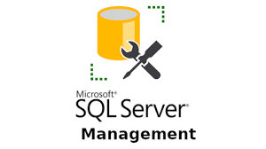

<div align="center">

# Azure SQL Lab – DIO ☁️🗄️

Documentação prática e direta sobre como criar e operar uma instância de banco de dados SQL no Microsoft Azure. Projeto do desafio DIO com foco em clareza, utilidade e referências oficiais.

</div>

---

## 🔎 Sobre o projeto
Guia completo e enxuto para configurar um banco no Azure SQL, entender as opções de segurança e conectar usando as ferramentas oficiais (Azure Portal, Azure Data Studio e SSMS).

## 🧭 Índice
- [📘 O que é o Azure SQL](#-o-que-é-o-azure-sql)
- [🚀 Passo a passo de criação](#-passo-a-passo-de-criação)
- [🔐 Rede e segurança](#-rede-e-segurança)
- [🛠️ Conexão e ferramentas](#️-conexão-e-ferramentas)
- [✅ Dicas e boas práticas](#-dicas-e-boas-práticas)
- [🔗 Materiais complementares](#-materiais-complementares)
- [🖼️ Imagens (oficiais)](#️-imagens-oficiais)
- [👤 Autor](#-autor)

---

## 📘 O que é o Azure SQL
O Azure SQL é a família de serviços SQL totalmente gerenciados na nuvem da Microsoft, baseada no SQL Server. Você escolhe o modelo que melhor se encaixa no seu cenário e o Azure cuida de patches, backups e alta disponibilidade.

Principais opções do portfólio:
- Single Database: banco isolado, ideal para cargas dedicadas por aplicação.
- Elastic Pool: vários bancos compartilhando recursos (economia com picos distribuídos).
- Managed Instance: alta compatibilidade com SQL Server e recursos de rede avançados.

Por que usar:
- Alta disponibilidade e backups automáticos.
- Escalabilidade por vCore/DTU e armazenamento elástico.
- Segurança integrada: TDE, firewall, AAD, auditoria.
- Monitoramento nativo e integração com o ecossistema Azure.

---

## 🚀 Passo a passo de criação
1) Acesse o Portal: https://portal.azure.com
2) Criar recurso > Banco de Dados SQL
3) Defina as propriedades:
    - Grupo de recursos, nome do banco e servidor (login admin e senha)
    - Região e camada de desempenho (DTU ou vCore)
    - Opções de redundância e backup, se aplicável
4) Rede e segurança:
    - Regras de firewall (permitir seu IP local ou rede corporativa)
    - Autenticação (SQL e/ou Azure AD)
    - Auditoria, TDE e alertas
5) Revisar + Criar e aguardar a implantação

Após provisionar, copie a string de conexão do recurso para uso no app ou ferramenta de cliente.

---

## 🔐 Rede e segurança
- Firewall do servidor: restrinja por IPs de confiança apenas.
- Autenticação: prefira Azure AD; mantenha o login SQL com senha forte e rotações periódicas.
- Criptografia: TDE habilitada por padrão; considere Always Encrypted para dados sensíveis.
- Auditoria e logs: habilite auditoria e encaminhe logs para Log Analytics/Storage.
- Acesso privado: quando possível, utilize Private Link/Endpoints.

---

## 🛠️ Conexão e ferramentas
- Azure Data Studio: leve, multiplataforma, ideal para consultas e desenvolvimento.
   - Download: https://learn.microsoft.com/sql/azure-data-studio/
- SQL Server Management Studio (SSMS): suíte completa de administração.
   - Download: https://learn.microsoft.com/sql/ssms/download-sql-server-management-studio-ssms

Exemplo de string de conexão (substitua pelos seus valores):

```
Server=tcp:seu-servidor.database.windows.net,1433;Initial Catalog=seu_banco;Persist Security Info=False;User ID=seu_admin;Password=SuaSenhaForte!;MultipleActiveResultSets=False;Encrypt=True;TrustServerCertificate=False;Connection Timeout=30;
```

---

## ✅ Dicas e boas práticas
- Use tags e grupos de recursos para organizar e padronizar.
- Defina alertas de métricas (DTU/vCore, storage, conexões).
- Revise periodicamente regras de firewall e permissões.
- Faça testes de carga em horários controlados antes de escalar.
- Documente decisões (região, SKU, segurança) no próprio repositório.

---

## 🔗 Materiais complementares
- Azure SQL – visão geral: https://learn.microsoft.com/pt-br/azure/azure-sql/
- Quickstart Managed Instance: https://learn.microsoft.com/pt-br/azure/azure-sql/managed-instance/quick-start-create
- Guia Markdown (GitHub): https://guides.github.com/features/mastering-markdown/
- Formação GitHub Certification (DIO): https://github.com/digitalinnovationone/formacao-github-certification

---

## 🖼️ Imagens (oficiais)

Imagens locais para ilustrar as etapas e ferramentas:




---

## 👤 Autor
Leandro Stampini — desafio DIO: Laboratório Azure SQL
